# 🏠 Home Assistant : Premium Glassmorphism Dashboard

---

## 🇫🇷 Français

### À propos de ce projet
Bienvenue dans le dépôt de mon dashboard Home Assistant personnel. Ce projet met en avant une interface **Premium** basée sur le concept de **Glassmorphism** (transparence, flou de mouvement, bordures lumineuses et designs épurés). L'objectif est d'allier une esthétique haut de gamme à une domotique puissante et réactive.

### 💻 Infrastructure Domotique
Mon système Home Assistant tourne sur **HAOS (Home Assistant Operating System) installé sur un Mini PC avec processeur Intel Core i7**. Cela permet d'avoir une configuration ultra puissante, capable de traiter la reconnaissance d'image pour mes caméras Tapo et Eufy, et de gérer mes automatisations complexes sans la moindre latence.

### 📸 Galerie des 31 Captures d'Écran (Screenshots)

#### 1. Overviews (Vues d'ensemble)
*Le centre de contrôle principal du Dashboard.*

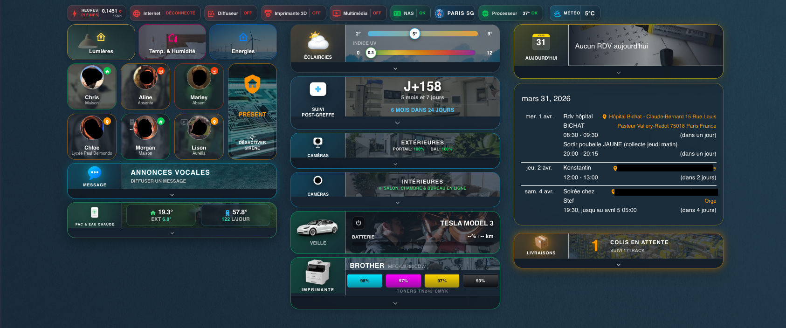  
*Overview.png*

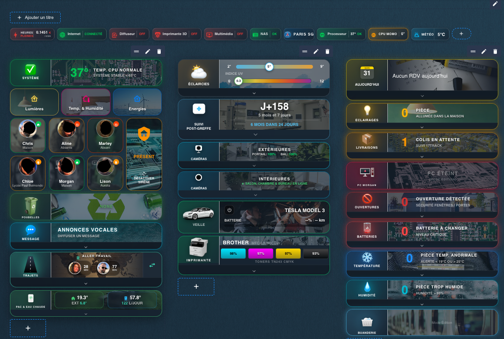  
*Overview_edit_mode.png*

#### 2. Views (Écrans dédiés)
*Les vues thématiques regroupant des logiques proches.*

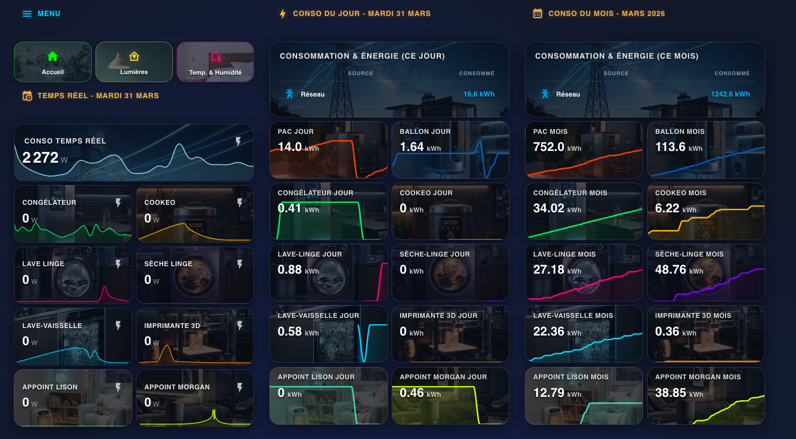  
*Energy_View.png*

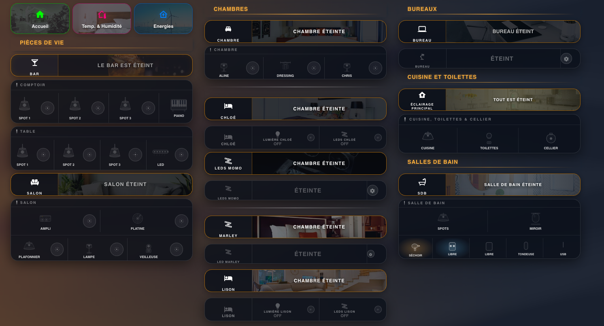  
*Light_view.png*

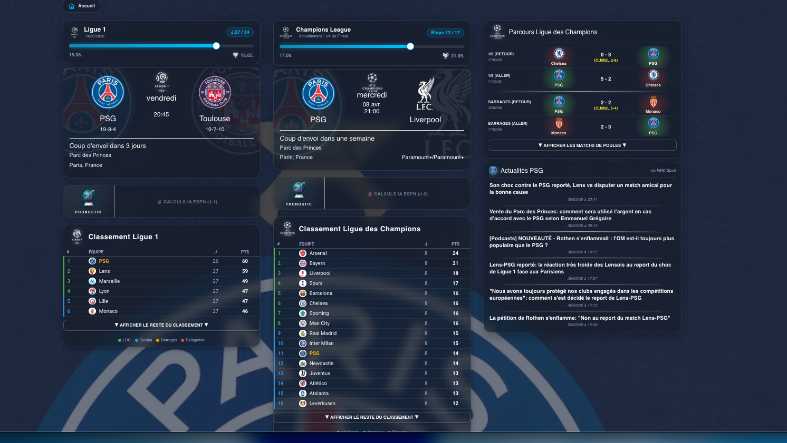  
*PSG_View.png*

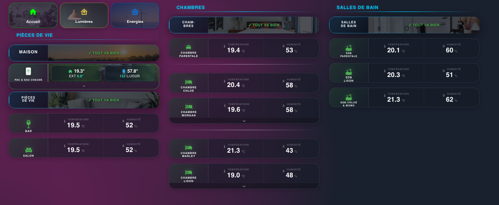  
*Temp_Hum_view.png*

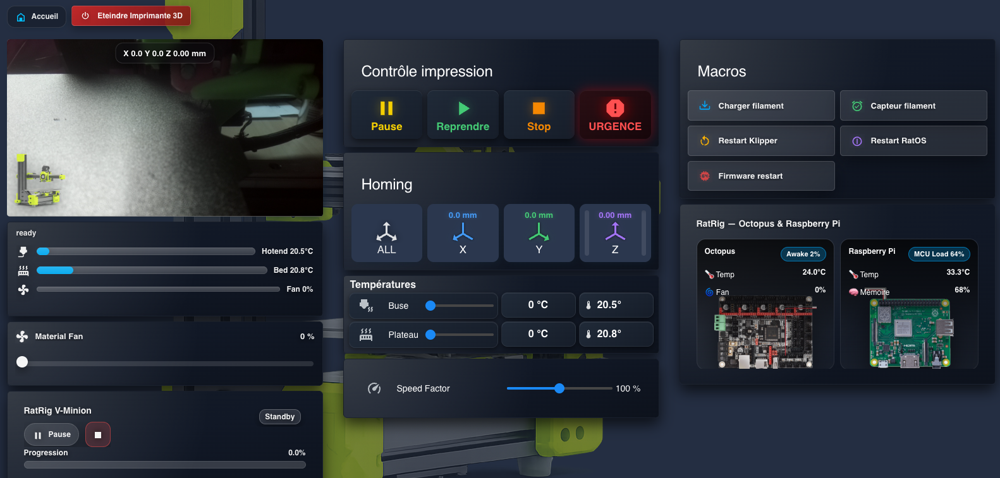  
*3d_Printer_view.png*

#### 3. Cards (Cartes premium individuelles)
*Les cartes "Glassmorphism" construites de zéro avec card-mod et button-card.*

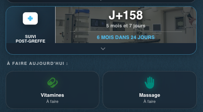  
*Medical_process_monitoring_card.png*

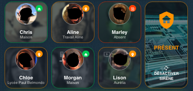  
*Person_and_security_card.png*

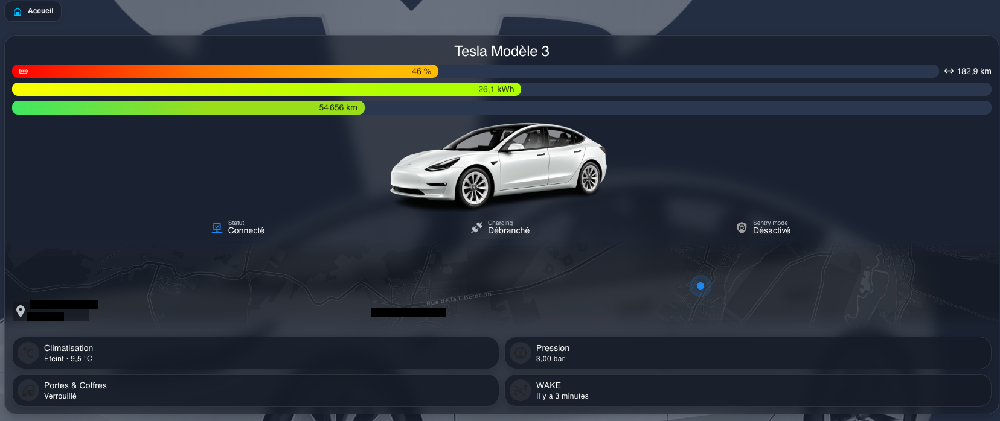  
*Tesla_card.png*

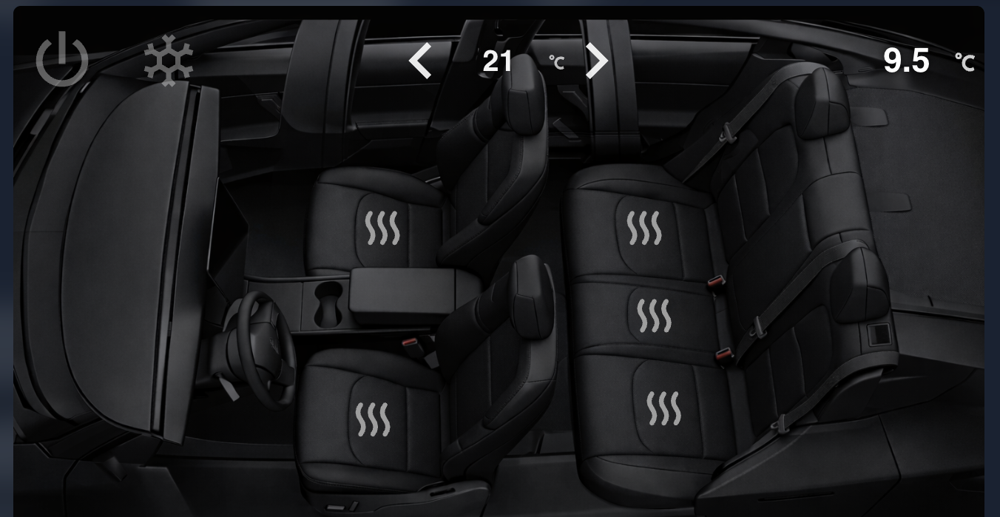  
*Tesla_climatisation_card.png*

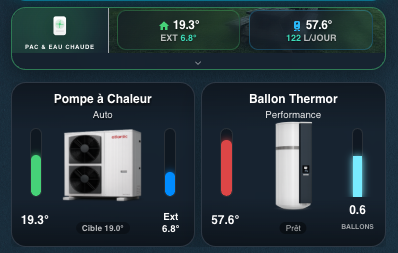  
*Ambiant_and_Hot_water_card.png*

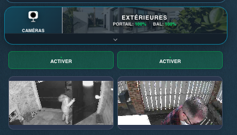  
*Ext_Camera_card.png*

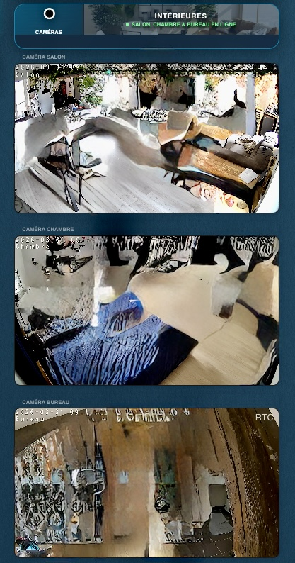  
*Int_Camera_card.jpeg*

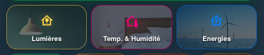  
*Menu_navigation_card.png*

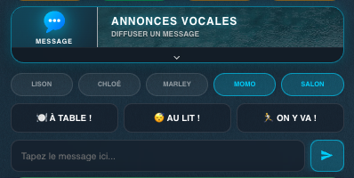  
*Message_Card.png*

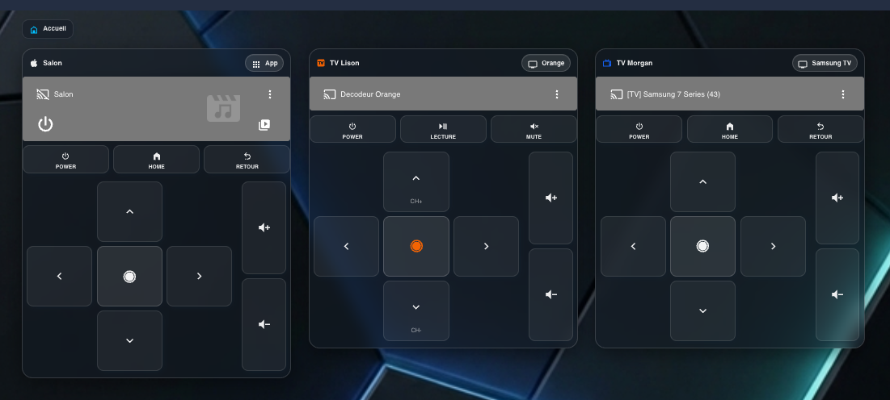  
*Multimedia_card.png*

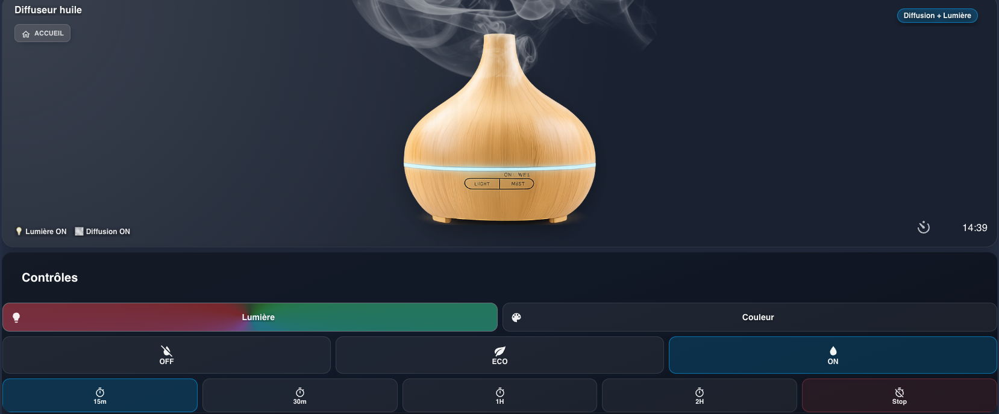  
*Oil_diffuser_card.png*

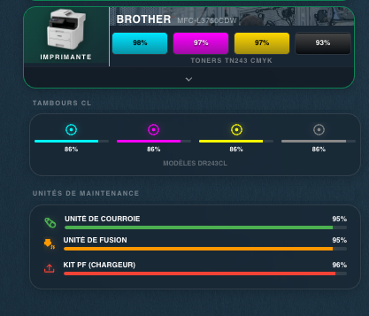  
*Printer_card.png*

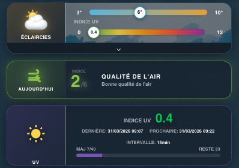  
*Weather_card.png*

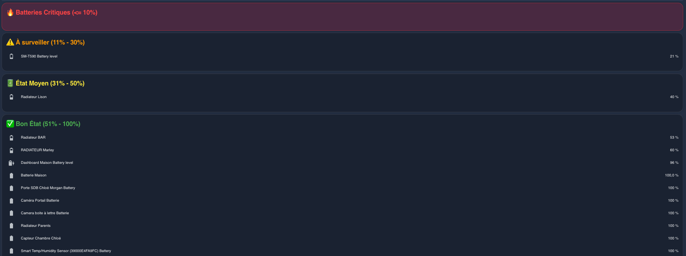  
*Battery_card.png*

#### 4. Alertes (Système de notifications UI dynamiques)
*Ces cartes conditionnelles n'apparaissent que lorsqu'une action est requise.*

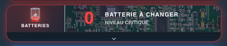  
*Battery_alert_card.png*

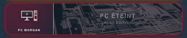  
*Children_computer_alert_card.png*

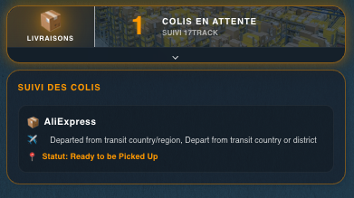  
*Delivery_card_alert.png*

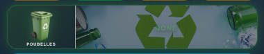  
*Garbage_alert_card.png*

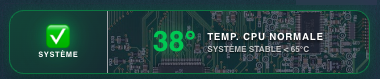  
*HA_CPU_alert_card.png*

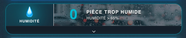  
*Humidity_alert_card.png*

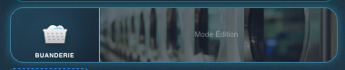  
*Laundry_room_alert_card.png*

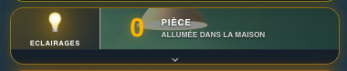  
*Light_alert_card.png*

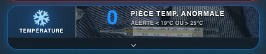  
*Temperature_alert_card.png*

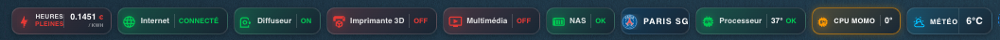  
*Navigation_Info_alert_badges.png*

---

### 📊 Classement des Intégrations & Composants
Voici la liste des entités et composants classés par ordre décroissant d'utilisation, analysés directement à partir de mon fichier `ui_lovelace.yaml`. Les cartes de style `custom:button-card` sont véritablement le cœur absolu du design Glassmorphism.

**Top Composants Visuels (Cartes) :**
1. `custom:button-card` : 566 utilisations
2. `grid` : 75 utilisations
3. `blank-card` : 36 utilisations
4. `custom:mod-card` : 36 utilisations
5. `image` : 35 utilisations
6. `horizontal-stack` : 34 utilisations
7. `custom:fold-entity-row` : 31 utilisations
8. `vertical-stack` : 31 utilisations
9. `icon` & `conditional` : 29 utilisations
10. `entities` : 27 utilisations
11. `custom:apexcharts-card` : 20 utilisations
12. `custom:auto-entities` : 14 utilisations

**Top Intégrations (Domaines des Entités) :**
1. `sensor` : 193 utilisations
2. `light` : 101 utilisations
3. `button` : 44 utilisations
4. `media_player` : 42 utilisations
5. `climate` : 36 utilisations
6. `switch` : 35 utilisations
7. `person` : 33 utilisations
8. `input_boolean` : 26 utilisations
9. `remote` : 25 utilisations
10. `binary_sensor` : 21 utilisations
11. `select` : 20 utilisations
12. `weather` : 11 utilisations
13. `number` : 9 utilisations
14. `alarm_control_panel` : 7 utilisations

### 📖 Notice d'utilisation du Dépôt
**Comment ce dépôt est maintenu et comment vous pouvez l'utiliser :**

1. **Le Script d'anonymisation** : Ce dépôt public est généré automatiquement depuis mon Home Assistant local grâce à un script Bash que j'ai mis en place (`sync_ha_github.sh`). Ce script nettoie le code de tous mes secrets (Remplacement automatique des IPs, Emails, Coordonnées GPS latitude/longitude, Mots de passe, et JWT par des tags `!secret ...`) à chaque synchronisation, supprimant de façon récursive toute donnée sensible. L'historique des commits est intentionnellement effacé et reconstitué à chaque push pour s'assurer qu’aucun vieux mot de passe ne perdure dans les méandres de Git.
2. **Utilisation des ressources graphiques** :
   * **Dossier `/www`** : Vous y trouverez toutes les images d'arrière-plan, icônes transparentes et fonds de cartes. Toutes les cartes personnalisées nécessitent ces images pour obtenir l'effet "Glassmorphism" désiré !
   * **Dossier `/screen`** : Sert de guide de référence visuel (les 31 captures présentées plus haut) pour comprendre à quoi correspond chaque partie de mon YAML.
3. **Clonage ou Reprises de sections** : Si vous reprenez mon code `ui_lovelace.yaml` (qui gère 100% de l'interface), n'hésitez pas à adapter vos entités (les noms de vos sensors propres) et assurez-vous d'avoir téléchargé les images `/www` sur votre Home Assistant, pour que le composant `card-mod` affiche parfaitement les overlays et flous d'arrière plan.

---

## 🇺🇸 English

### About this project
Welcome to my personal Home Assistant dashboard repository. This project focuses strictly on a **Premium Glassmorphism** interface.
My entire smart home system is powered by **HAOS installed on an Intel Core i7 Mini PC** for zero-latency automation processing and heavy camera stream processing.

### 📸 31 Screenshots Gallery Matches the French Section
(Please see the image links in the French section above, perfectly organized by Overviews, Views, Cards, and Alerts, with filenames listed below each image).

### 📊 Integrations & Components Highlights
The core of this UI relies heavily on `custom:button-card` (which is used exactly 566 times!). Other top domains include `sensor` (193 integrations) and `light` (101 integrations). You can view the full statistical ranking of components in the French section above.

### 📖 How to utilize this repository
1. **Automated Sync Script**: Everything published in this repo is automatically scraped and cleaned by my bash script `sync_ha_github.sh`. All IPs, exact GPS coordinates, emails, passwords, and tokens are replaced by `!secret` tags. The Git history is completely overwritten upon each commit to avoid lingering sensitive data.
2. **Graphic Assets (Important)**: To replicate my frosted-glass effects and background cards, you MUST download all images from the `/www` directory and copy them to your own local Home Assistant setup.
3. **Reference**: Check the `/screen` folder to understand what each custom card in `ui_lovelace.yaml` achieves visually.
